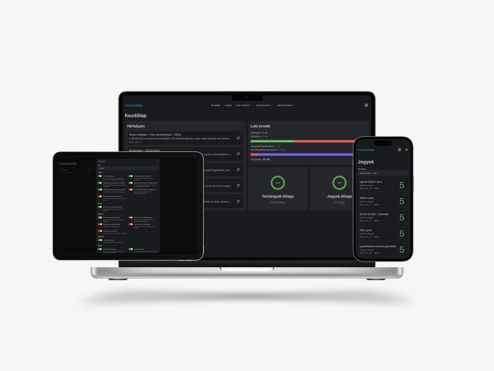
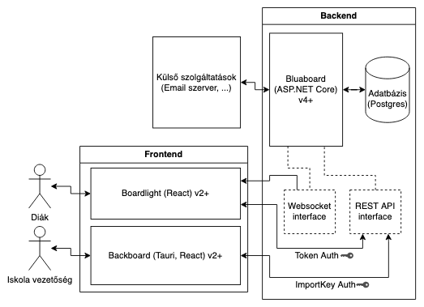

# LovassyApp

A Lovassy László Gimnázium diákjainak életét megkönnyíteni hivatott alkalmazás.

*Megjegyzés: Ez a repo a jelenlegi legújabb, fejlesztés alatti verziót tartalmazza. Blueboard v4 előtti verziók megtekinthetők itt: https://github.com/LovassyApp/LovassyAppLegacy. Ezt a verziót a 2023/2024-es tanév elején tervezzük bevezetni.*

## Funkciók

- [x] Lovassy Lóvé rendszer
  - [x] Automatikus LoLó generáció
  - [x] LoLó kérvények benyújtása (pl.: versenyeredményért járó LoLó)
  - [x] LoLó elköltése kimentésekre és egyéb termékekre
  - [x] Vásárolt termékek felhasználása
- [X] Jegyek megtekintése
- [X] Hírek megtekintése a [Lovassy weboldaláról](http://web.lovassy.hu)
- [ ] Párt rendszer (párthéthez)
  - [ ] Pártok létrehozása, regisztálása
  - [ ] Pártprogramok megtekintése
  - [ ] Szavazás
- [ ] Szavazó rendszer (farsangi jelmezversenyhez, stb.)
- [ ] Éjszakai röpi rendszer
  - [ ] Röpi csapatok létrehozása, regisztálása
  - [ ] Értesítések meccsek előtt
  - [ ] Pontozás, kivetítendő pontozó tábla
- [ ] Menza rendszer
  - [ ] A vagy B menü igénylése digitálisan
  - [ ] Kajajegy helyett újra felhasználható NFC kártyák/telefonos NFC

*A tervezett funkciók sorrendje megegyezik a prioritási sorrendjükkel.*

## Rövid háttértörténet

A LovassyApp fejlesztését eredetileg [Gyimesi Máté](https://github.com/minigyima) és [Ocskó Nándor](https://github.com/Xeretis) kezdte el a covid okozta karantén alatt (bár az ötlet már hamarabb megvolt). Eredetileg a KRÉTA API-t használva működött a jegyek importálása, de sajnos a fejlesztés során kiderült, hogy a KRÉTA ezt nem engedélyezi. Egy hosszabb szünet után a 2022/2023-as tanév elején sikerült előállnunk egy alternatív megoldással a jegyek importálására, így a projekt folytatódott. A 2022/2023-as tanév vége felé úgy döntöttünk, hogy bővítjük a projekt célkitűzéseit és ezzel egyetemben újra is írjuk a már meglévő rendszert, és ez a Blueboard v4 valamint a Backboard v2 és a Boardlight v2 (azaz ami ebben a repoban van). 

## A fejlesztéshez csatlakozni kívánóknak

*Minden kontribúciónak örülünk, amennyiben nem tudod hogy miben tudsz segíteni, de szeretnél, csak keress meg minket Messengeren (Ocskó Nándor vagy Gyimesi Máté).*

A publikus API dokumentáció az aktuális vezrióhoz elérhető [itt](https://bump.sh/xeretis/doc/lovassyapp).

### A LovassyApp részei

- **Blueboard**: A LovassyApp backend-je, [ASP.NET Core](https://learn.microsoft.com/en-us/aspnet/core/introduction-to-aspnet-core?view=aspnetcore-7.0) keretrendszerben íródott.
- **Boardlight**: A LovassyApp diákoknak szánt frontend-je, [React](https://react.dev/) keretrendszerben íródott.
- **Backboard**: A LovassyApp iskolavezetőségnek szánt asztali frontend-je, [Tauri](https://tauri.studio/) és [React](https://react.dev/) keretrendszerben íródott.

### Futtatás lokálisan

#### Blueboard

A Blueboard futtatásához szükséges a [.NET 7 SDK](https://dotnet.microsoft.com/en-us/download/dotnet/7.0). Amennyiben ez megvan ajánlott a `LovassyApp.sln` fájlt egy választott fejlesztői környezetben megnyitni és a solutionben található futási konfigurációt használni.

Alternatív módon a `dotnet restore` parancs futtatása után a `Blueboard` mappában futtatható `dotnet run` parancs, amennyiben a .NET 7 SDK telepítve van.

Az első indítás előtt konfigurálj lokálisan egy postgres adatbázist a `Blueboard/appsettings.Development.json`-ban található `ConnectionStrings:DefaultConnection` connection string alapján (saját értéket is beállíthatsz itt és azt is használhatod, csak ne commitold). Ez után futtasd az adatbázis migrációkat a `dotnet ef database update` paranccsal a `Blueboard` mappában.

**Fontos**: Futás előtt globálisan állítsd be a `ASPNETCORE_ENVIRONMENT=development` env változót máskülönben a build lépés egy hibát fog dobni.

#### Boardlight

A Boardlight futtatásához szükséges a [Node.js](https://nodejs.org/en/) és a [pnpm](https://pnpm.io/) telepítése. Amennyiben ez megvan ajánlott a `Boardlight` mappában a `pnpm install` parancs után a `pnpm start` parancs futtatása.

**Fontos**: Futtatás előtt hozz létre egy `.env` fájlt a `Boardlight` mappában a `.env.example` fájl alapján és töltsd ki!

#### Backboard

A Backboard futtatásához szükséges a [Node.js](https://nodejs.org/en/), a [Rust](https://www.rust-lang.org/) és a [pnpm](https://pnpm.io/) telepítése. Amennyiben ez megvan ajánlott a `Backboard` mappában a `pnpm install` parancs után a `pnpm tauri dev` parancs futtatása.
